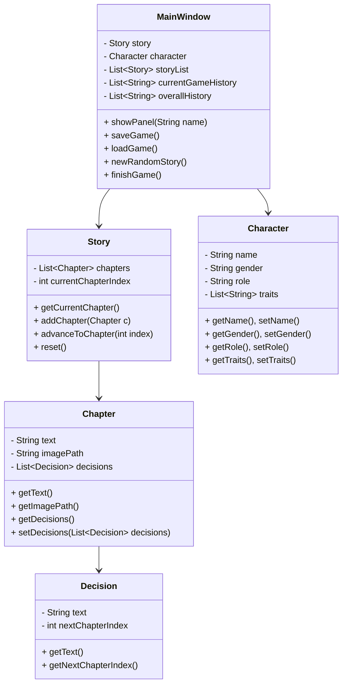

# Project Group Number:
## Group 01


# Project Topic/Name:
# NarrateIT – Interactive Storytelling App

An immersive Java-based application that lets users explore deep, branching narratives through an interactive storytelling experience. The app uses external CSV files to load richly detailed stories, allowing for easy updates and expansion of the narrative content.

---

## Overview

The Interactive Storytelling App enables users to:

- Navigate through deep stories with multiple chapters (15 stories with 30 chapters each).
- Make choices at each chapter that influence the narrative direction.
- Customize their character’s details and role, which affects how the story is presented.
- View a history of past adventures and save/load game progress.

---


# Object-Oriented Concepts:
- **Encapsulation** – All classes maintain data privacy using private attributes and public accessors/mutators.
- **Inheritance** – Can be extended further for different types of stories or characters.
- **Polymorphism** – UI components and actions respond differently based on the state (e.g., character role affecting narrative).
- **Abstraction** – Clear separation between UI handling, logic, and data models.

---

## Features

- **Deep, Immersive Narratives**  
  15 stories, each with 30 chapters of detailed, engaging narrative text.

- **Branching Decisions**  
  Each chapter (except the final one) provides two decision options that lead to the next chapter, enabling a dynamic experience.

- **CSV-based Story Content**  
  Story data is stored in an external CSV file (`stories.csv`), making it easy to update or add new stories without changing the code.

- **Character Customization**  
  Users can set their name, gender, role (e.g., Adventurer, Warrior, Wizard, Diplomat), and traits, which influence the perspective of the story.

- **Game History & Save/Load**  
  The application records the chapters from your current journey and maintains an overall history of completed games.

---

## Technology Stack

- **Language**: Java 8
- **UI Framework**: Java Swing
- **CSV Parsing**: OpenCSV
- **Build Tool**: Maven
- **Version Control**: Git & GitHub 

---

## Project Structure

```
interactive-story-app/
├── README.md
├── src/
│   └── main/
│       ├── java/
│       │   └── neu/
│       │       └── csye6200/
│       │           └── edu/
│       │               ├── InteractiveStoryApp.java
│       │               ├── ui/
│       │               │   ├── MainWindow.java
│       │               │   ├── MainMenuPanel.java
│       │               │   ├── StoryPanel.java
│       │               │   ├── CustomizationPanel.java
│       │               │   ├── SaveLoadPanel.java
│       │               │   └── HistoryPanel.java
│       │               ├── model/
│       │               │   ├── Story.java
│       │               │   ├── Chapter.java
│       │               │   ├── Decision.java
│       │               │   └── Character.java
│       │               └── util/
│       │                   └── StoryLoader.java
│       └── resources/
│           ├── backgrounds/
│           │   ├── start.jpg
│           │   └── end.jpg
│           └── stories.csv    
```

---

## UML Class Diagram – Interactive Storytelling App



---


## 📄 CSV File Format

The `stories.csv` file is structured as follows:

```csv
storyId,chapterOrder,text,imagePath,decision1Text,decision1Next,decision2Text,decision2Next
```

| Column             | Description                                                                 |
|--------------------|-----------------------------------------------------------------------------|
| `storyId`          | Unique identifier for each story (e.g., S001)                              |
| `chapterOrder`     | The chapter number within the story                                        |
| `text`             | Detailed narrative text for the chapter                                    |
| `imagePath`        | File name of an image associated with the chapter                          |
| `decision1Text`    | Descriptive text for the first decision option                             |
| `decision1Next`    | Chapter number the first decision points to                                |
| `decision2Text`    | Descriptive text for the second decision option                            |
| `decision2Next`    | Chapter number the second decision points to                               |

> **Note:** The application automatically strips prefixes like `"Story S001, Chapter 1:"` from the chapter text before displaying.

---

## Getting Started

### 1. Clone the Repository

```bash
git clone https://github.com/saralasharanappa/NarrateIT.git
cd InteractiveStoryApp
```

### 2. Build the Project

Ensure you have [Maven](https://maven.apache.org/download.cgi) installed.

```bash
mvn clean install
```

### 3. Run the Application

```bash
mvn exec:java -Dexec.mainClass="org.example.InteractiveStoryApp"
```

### 4. Verify CSV Placement

Ensure that `stories.csv` is located in:

```
src/main/resources/stories.csv
```

This allows the file to be correctly loaded from the classpath.

---

## Customization

### Story Content

Edit `stories.csv` to add new stories or chapters. Each story should maintain a consistent `storyId`, and each chapter should have a unique `chapterOrder`.

### Character Customization

The character’s role affects how the story is narrated (e.g., Warriors receive strength-based perspectives, Wizards get mystical details).

---

# Functionalities for Milestone 2:
- Implement story loading from CSV files (15+ stories with 30 chapters each).
- Display chapter narratives with branching decisions.
- Character customization (name, gender, role, traits).
- Dynamic story perspective based on selected character role.
- Persistent history of completed games.
- Save/Load functionality using serialization.
- Navigation via a top-level menu and visual enhancements using images per chapter..

---

# Contributions:
- **Sarala Sharanappa** – CStoryLoader and CSV integration, chapter rendering, and decision button interactivity.
- **Rushitaben Pravinbhai Vachhani** – project structuring, backend infra, styles
- **Amisha Bhawsar** – Frontend UI Framework design: Java Swing

---

## License

This project is licensed under the MIT License. See the `LICENSE` file for details.

